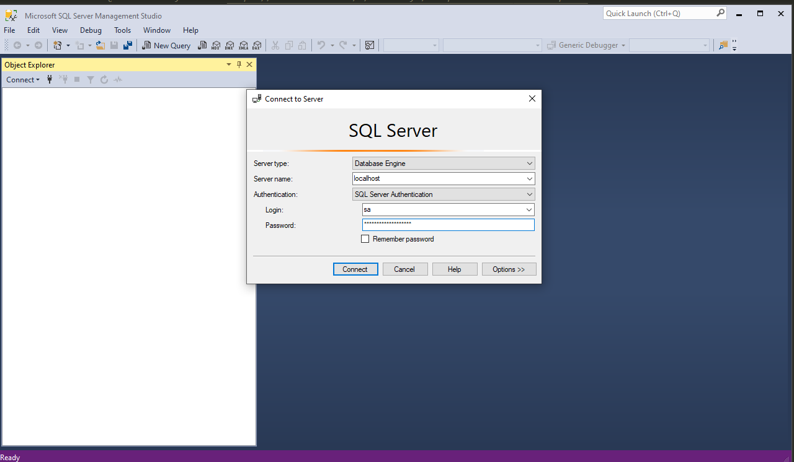

# In this demo we're going to populate a SQL Server running on a container from code.
> Docker Hub SQL server express reference: https://hub.docker.com/r/microsoft/mssql-server-windows-express

```
 <add name="YOURCONTEXTNAME" connectionString="Data Source=.\SQLEXPRESS;Initial Catalog=YOURDATABASENAME;Integrated Security=SSPI"
       providerName="System.Data.SqlClient" />
```

* Start a new sql server express instance

```
docker run -d -p 1433:1433 -e sa_password=MyCoolPassword@1234 -e ACCEPT_EULA=Y microsoft/mssql-server-windows-express
```

Now we can connect from __SSMS__.

* Use EF to populate a database instance

> https://entityframework.net/migration

Edit _App.config_ as follows:

```xml
<add name="BookContext" connectionString="Data Source=localhost,1433;Initial Catalog=Books;User ID=sa;Password=MyCoolPassword@1234"
       providerName="System.Data.SqlClient" />
```

Start the container again if it's already stopped

```
docker run -d -p 1433:1433 -e sa_password=MyCoolPassword@1234 -e ACCEPT_EULA=Y microsoft/mssql-server-windows-express
```

Now we're pointing to the server that's currently running a sql server express instance. 

Run the console project.

Now we can connect from __SSMS__. And watch the new generated entry.

