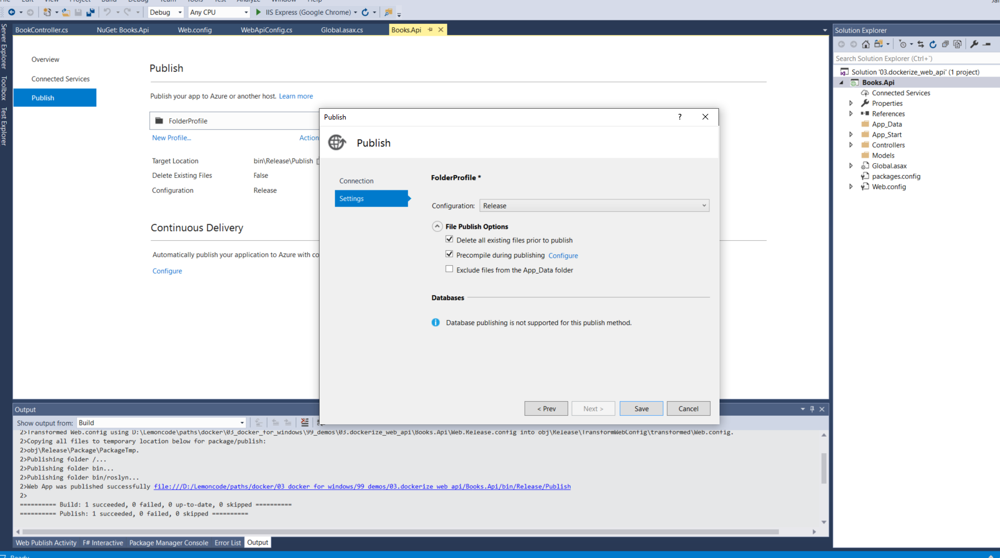
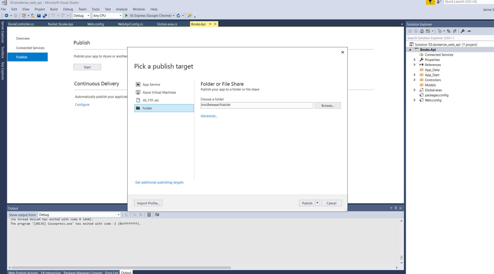

# In this demo we're going to dockerize an ASP.NET Web API app

## Create a new Web API 2 application

* Open Visual Studio and create a new solution. 
* Inside this solution create a empty Web API 2 project. Select __4.8__ version or above.

Let's start by creaing a simple controller that will return something dummy. Just to ensure that the server is alive:

```cs
using System.Web.Http;

namespace Books.Api.Controllers
{
    [RoutePrefix("api/greet")]
    public class GreetController : ApiController
    {
        [HttpGet]
        [Route("hello")]
        public string SayHello()
        {
            return "Hello from server";
        }
    }
}

```

Edit WebApiConfig.cs

```diff
using System;
using System.Collections.Generic;
using System.Linq;
+using System.Net.Http.Headers;
using System.Web.Http;

namespace Books.Api
{
    public static class WebApiConfig
    {
        public static void Register(HttpConfiguration config)
        {
+           config.Formatters.JsonFormatter.SupportedMediaTypes
+               .Add
+               (
+                   new MediaTypeHeaderValue("text/html")
+               );
            // Web API configuration and services

            // Web API routes
            config.MapHttpAttributeRoutes();

            config.Routes.MapHttpRoute(
                name: "DefaultApi",
                routeTemplate: "api/{controller}/{id}",
                defaults: new { id = RouteParameter.Optional }
            );
        }
    }
}

``` 

Edit Global.asax.cs

```diff
+using Newtonsoft.Json.Serialization;
using System.Web.Http;

namespace Books.Api
{
    public class WebApiApplication : System.Web.HttpApplication
    {
        protected void Application_Start()
        {
+           GlobalConfiguration.Configuration.Formatters.JsonFormatter.SerializerSettings.ContractResolver = new CamelCasePropertyNamesContractResolver();
            GlobalConfiguration.Configure(WebApiConfig.Register);
        }
    }
}

```

Now that we have this on place, lets add a controller that will return some books, to do this, we're going to use a running container with the database.

Add reference to _Book.DAL_ and _EF 6_.

Create _BookController.cs_

```cs
using Book.DAL;
using System.Collections.Generic;
using System.Linq;
using System.Web.Http;

namespace Books.Api.Controllers
{
    public class BookController : ApiController
    {
        private BookContext _bookContext;

        public BookController()
        {
            _bookContext = new BookContext();
        }

        [HttpGet]
        [Route("api/books")]
        public IEnumerable<Book.DAL.Book> GetBooks()
        {
            var books = _bookContext.Books.ToList();
            return books;
        }
    }
}
```

Now we have to add the connection string in _Web.config_

```diff
....
<configuration>
  <configSections>
    <!-- For more information on Entity Framework configuration, visit http://go.microsoft.com/fwlink/?LinkID=237468 -->
    <section name="entityFramework" type="System.Data.Entity.Internal.ConfigFile.EntityFrameworkSection, EntityFramework, Version=6.0.0.0, Culture=neutral, PublicKeyToken=b77a5c561934e089" requirePermission="false" />
  </configSections>
+ <connectionStrings>
+   <add name ="BookContext" connectionString="Data Source=localhost,1433;Initial Catalog=Books;User ID=sa;Password=MyCoolPassword@1234"
+      providerName="System.Data.SqlClient" />
+ </connectionStrings>
  <appSettings></appSettings>
....
```

Let's get up the database to work with our API, fom __04_develop_on_windows_containers\02.persisting_data_volume\docker-compose.yml__

```bash
docker-compose up
```

We can go now to the browser _http://localhost:53756/api/books_ and check that is returning:

```json
[{"id":1,"title":"Introduction to Docker"}]
```

Now we can _publish_ our application, open the target location, and add this _Dockerfile_ in _.\Books.Api_ folder.

* Set the publish configuration as follows



* Notice where is placed the publish package



_.\Books.Api\bin\Release\Publish_

```Dockerfile
FROM mcr.microsoft.com/dotnet/framework/aspnet:4.8

WORKDIR /inetpub/wwwroot

COPY /bin/Release/Publish .
```

Now we can build the app from _.\Books.Api_

```ps1
docker build -t web-api-books .
```

To check that content is placed where we spec:

```ps1
docker run web-api-books
```

From another poweshell

```ps1
docker exec -it <container name> powershell
```

Ok now is time to check our application in the browser

```ps1
docker run -d -p 8000:80 --name web-api-books web-api-books
```

Now we can visit _http://localhost:8000/api/greet/hello_, but what about _http://localhost:8000/api/books_? We get an error, we can have a look inside the logs container:

```ps1
docker exec -it web-api-books powershell
```

Inside the terminal we can navigate to _C:\Windows\System32\LogFiles_, this is not working because the server where is looking for is not now in the loopback. So let's use _docker-compose_ to solve this issue.

```yml
version: '3.7'

services: 
    books-db:
     image: 'mssql-express-init' 
     ports:
        - '1433:1433'
     environment: 
        - 'ACCEPT_EULA=Y'
        - 'sa_password=MyCoolPassword@1234'
        - attach_dbs=[{"dbName":"Books","dbFiles":["C:\\MSSQL\\Books.mdf","C:\\MSSQL\\Books_log.ldf"]}]
    
    books-api:
     build: .
     environment: 
        BookContext: "Data Source=books-db,1433;Initial Catalog=Books;User ID=sa;Password=MyCoolPassword@1234"
     depends_on: 
        - 'books-db'
     ports:
        - '80:80'
```

Ok great, but how can we deal with _env variables_? There're some approachs that we can take, because we're in _4.8_ version we can go ahead with:

* __Microsoft.Configuration.ConfigurationBuilders.Base__ is the infrastructure to intercept any calls to web.config to read configuration and it provides the option to have a configuration builder override the values in the current file.

* __Microsoft.Configuration.Configurationbuilders.Environment__ is the implementation to read from environment variables and override specific sections of the web.config file. The sections supported at the momen are: Connectionstrings, where you can replace the connectionstring value (not the providerName!) and the appsettings section in your config file.

Add these packages via _Nugget_

```diff
....
-<connectionStrings>
+<connectionStrings configBuilders="Environment">
   <add name="BookContext" connectionString="Data Source=localhost,1433;Initial Catalog=Books;User ID=sa;Password=MyCoolPassword@1234" providerName="System.Data.SqlClient" />
</connectionStrings>
....
```